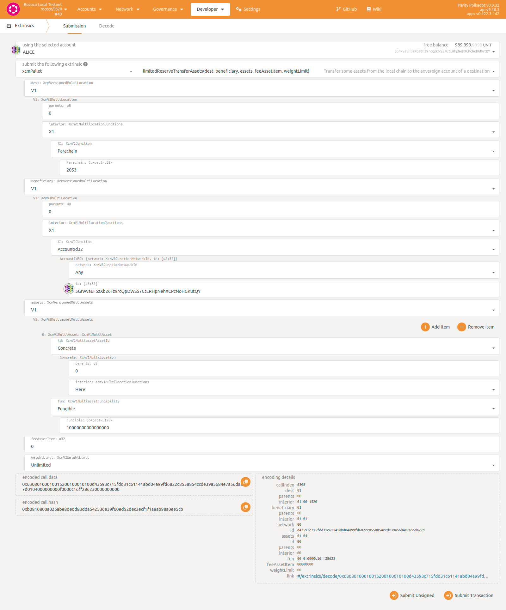
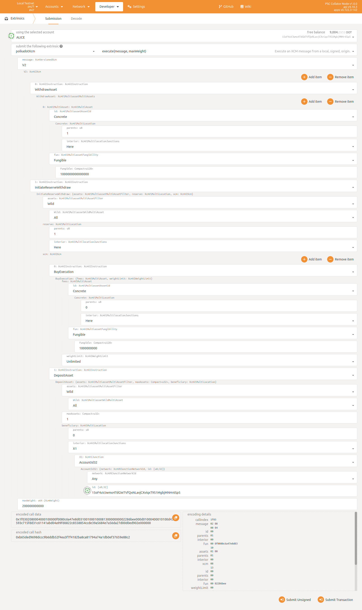

# Polkadot Smart Chain (PSC)
  PSC is an acronym for polkadot smart contract platform. It is an EVM smart contract parachain with DOT as the native Gas fee.

## Polkadot's Parachain
PSC is a Polkadot parachain which uses directly `DOT` as transaction fees and jointly developed by the ChainX team and OmniBTC team.
The ChainX team will build PSC into a cross-chain interoperability hub among the Bitcoin network, Polkadot ecology, EVM ecology, MoveVM ecology, and Cosmos ecology based on technologies such as Zkrollup, XCMP, ibc, and Lightning Network.

## Part of OmniBTC liquidity aggregation
[DolaProtocol](https://github.com/OmniBTC/OmniProtocol)  is a chain-wide liquidity aggregation and settlement system with the single coin pool of each public chain as the core, Wormhole, Layerzero and other cross-chain messaging protocols as the bridge, and Sui public chain as the settlement center.

There are `DOT` and assets of each parachain on the Polkadot platform. We will deploy a single currency pool on the Polkadot Smart Chain to become OmniBTC’s liquidity pool site on the Polkadot platform, which is connected to other Polkadot parachains through the XCMP protocol. 
***Committed to allowing the original assets on Polkadot to circulate with mainstream native assets such as BTC/ETH.***

## Build, test and launch local testnet

### build and test
```bash
git clone https://github.com/OmniBTC/PSC.git

cd PSC

cargo test --release

cargo build --release
```

### launch local testnet

Use [zombienet](https://github.com/paritytech/zombienet) launch a local testnet.

For `provider=native`(linux/macos, binaries), require build [psc](https://github.com/OmniBTC/PSC) and our modified [polakdot](https://github.com/OmniBTC/polkadot/tree/release-v0.9.32-fix)

Run: [zombienet-linux-x64 spawn --provider native ./psc-small-network.toml](./zombienet/psc-local-launch-native.sh)

For `provider=podman`(linux, dockers), require install [podman](https://podman.io/getting-started/installation)

Run: [zombienet-linux-x64 spawn --provider podman ./psc-small-network.toml](./zombienet/psc-local-launch-podman.sh)

## Transfer DOT from Polkadot to PSC by DMP



## Transfer DOT from PSC to Polkadot by UMP



## Evm support

### Metamask (for account)
```txt
Network name: Polkadot Smart Chain
RPC URL: https://psc-parachain.coming.chat/rpc
Chain ID: 1508
Currency symbol: DOT
```

For [local zombienet](./zombienet/psc-small-network.toml), use `RPC URL: http://127.0.0.1:8546`

Refer [Connect MetaMask to Moonbeam](https://docs.moonbeam.network/tokens/connect/metamask/)

### Remix (for contract)

Refer [Interacting with Moonbeam Using Remix](https://docs.moonbeam.network/builders/build/eth-api/dev-env/remix/)

### Ethereum apis
- [Ethereum JSON-RPC.postman_collection](./docs/Ethereum_JSON-RPC.postman_collection.json)
- [Ethereum RPC Support](https://github.com/PureStake/moonbeam-docs-cn/blob/master/builders/get-started/eth-compare/rpc-support.md)
- [QuickNode Ethereum RPC](https://www.quicknode.com/docs)
- [Ethereum JSON-RPC Wiki](https://eth.wiki/json-rpc/API#)

### Substrate Account & EVM address
This [article](./docs/substrate_and_evm_address_on_psc.md) introduce how the Ethereum address and Substrste account are associated

On PSC, [pallet-assets-bridge](./pallets/assets-bridge/README.md) bind EVM address and Substrate account, bind WASM assets and Erc20 tokens, deposit and withdraw fungible assets between WASM and EVM.

This [tool](./scripts/js/src/evm_to_dot.js) can convert EVM address to Substrate(Polkadot) account.

As we all know, DOT decimals=10, Metamask supports evm chain with decimals=18 by default.

In order to be compatible with Metamask, [chainx-frontier](https://github.com/chainx-org/frontier) has done the following for Native Currency Balance
- (1) `wasm -> evm` (get_Balance): expand 10^8
- (2) `evm -> wasm` (calc gas fee): shrink 10^8

It is safe and acceptable.

### Deploy contracts

Follow this [test guide](./docs/test_guide.md), learn how to deploy evm contracts.

## Basic data
```txt
EXISTENTIAL_DEPOSIT = 0.01 DOT
wasm transfer:  0.0047732 DOT
evm transfer:  0.0046515 DOT
evm-address mapping reseve: 0.1 DOT
```
