# Test Guide

## 1. Prepare: launch local testnet

### 1.1 Build relaychain: polkadot

```bash

git clone https://github.com/OmniBTC/polkadot.git

cd polkadot 
git checkout release-v0.9.32-fix

cargo build --release

```

### 1.2 Build parachain: psc

```bash

git clone https://github.com/OmniBTC/PSC.git

cargo build --release

```

### 1.3 Install zombienet

[zombienet](https://github.com/paritytech/zombienet) aims to be a testing framework for Substrate based blockchains, 

providing a simple cli tool that allows users to spawn and test ephemeral networks.

### 1.4 Launch testnet with native(recommend)

Make sure that `zombienet`, `polkadot` and `psc` in your `PATH`.

```bash
cd PSC

zombienet spawn --provider native ./zombienet/psc-small-network.toml
```

### 1.5 Launch testnet with podman
We provide `polkadot` and `psc` docker images to support `podman`.

```bash
docker pull comingweb3/polkadot:v0.9.32 
docker pull comingweb3/psc:latest
```

```bash
cd PSC

zombienet spawn --provider podman ./zombienet/psc-small-network.toml
```


## 2. Basic 1: substrate account get DOT

### 2.1 Connect to polkadot wallet
Direct use `polkadot.js.org` for develop accounts

### 2.2 Explore relaychain

Direct link: `https://polkadot.js.org/apps/?rpc=ws://127.0.0.1:9944#/explorer`

### 2.3 Explore parachain

Direct link: `https://polkadot.js.org/apps/?rpc=ws://127.0.0.1:9977#/explorer`

### 2.4 Transfer DOT from relaychain to parachain by DMP

transfer `10000000000000000` (means 1000000 DOT, decimals=10) to Alice(`5GrwvaEF5zXb26Fz9rcQpDWS57CtERHpNehXCPcNoHGKutQY`)


### 2.5 Transfer DOT from parachain to relaychain by UMP

transfer `1000000000000000` (means 100000 DOT, decimals=10) to Alice(`15oF4uVJwmo4TdGW7VfQxNLavjCXviqxT9S1MgbjMNHr6Sp5`)


## 3. Basic 2: evm account get DOT(On PSC)

### 3.1 Connet to metamask

```txt
Network name: Polkadot Smart Chain
RPC URL: http://127.0.0.1:8546
Chain ID: 1508
Currency symbol: DOT
```

### 3.2 Bind evm and substrate address with 0.1 DOT

Eth Signed Data Format

```txt
"evm:" + substrate_pubkey_hex_without_0x
```

#### 3.2.1 Get the public key hex string
`Alice` account address: `15oF4uVJwmo4TdGW7VfQxNLavjCXviqxT9S1MgbjMNHr6Sp5`

Use [this online tool](https://polkadot.subscan.io/tools/format_transform?input=15oF4uVJwmo4TdGW7VfQxNLavjCXviqxT9S1MgbjMNHr6Sp5&type=Public%20Key)
can get its public key: `0xd43593c715fdd31c61141abd04a99fd6822c8558854ccde39a5684e7a56da27d`

To sign data is `evm:d43593c715fdd31c61141abd04a99fd6822c8558854ccde39a5684e7a56da27d`

#### 3.2.2 Get signature by Remix sign tool

Open [remix](https://remix.ethereum.org/) connect to metamask(select you evm account, here is `0x6CfE5574639Ba46d74b6b67D2651d1470E10BA9a`)

Use remix sign tool, to sign `evm:d43593c715fdd31c61141abd04a99fd6822c8558854ccde39a5684e7a56da27d`

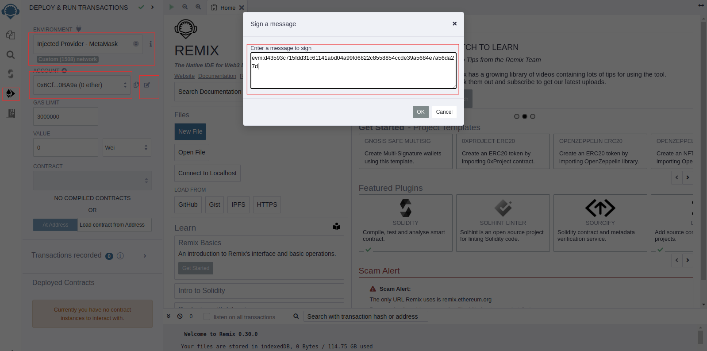


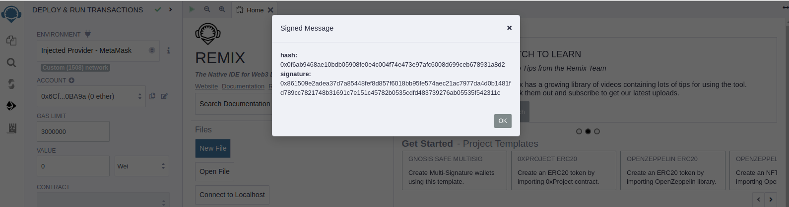

Get the signature: `0x861509e2adea37d7a85448fef8d857f6018bb95fe574aec21ac7977da4d0b1481fd789cc7821748b31691c7e151c45782b0535cdfd483739276ab05535f542311c`


#### 3.2.3 Call assetsBridge->claimAccount

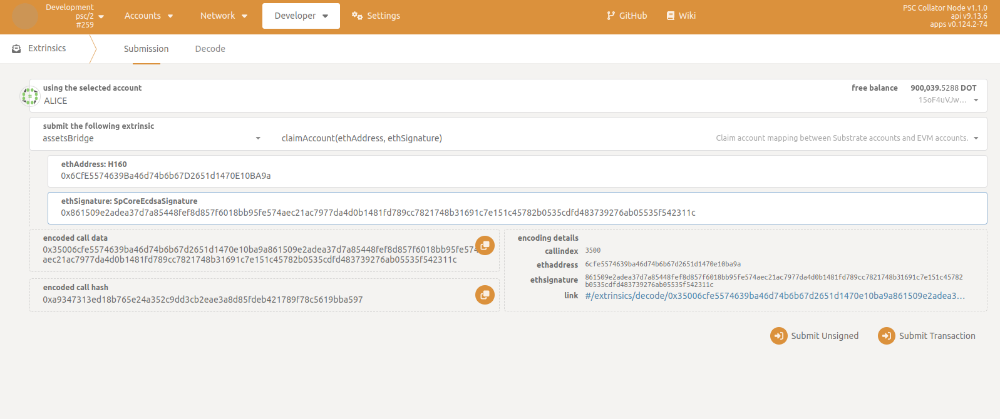

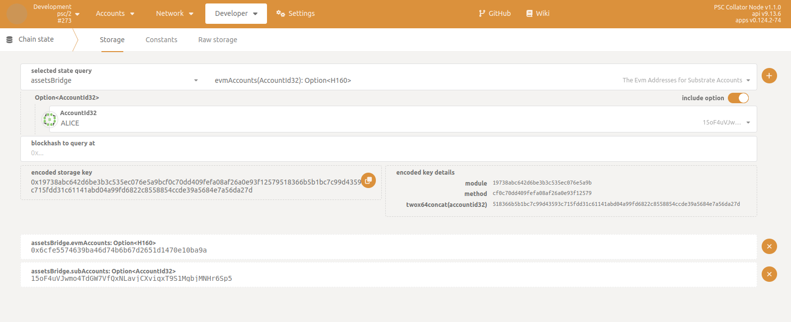

The evm address `0x6CfE5574639Ba46d74b6b67D2651d1470E10BA9a` has been bound to the `Alice` substrate address `15oF4uVJwmo4TdGW7VfQxNLavjCXviqxT9S1MgbjMNHr6Sp5`.

### 3.3 Deposit some DOTs to evm account

Call `assetsBridge->teleport`

deposit `1000000000000` (means 100 DOT, decimals=10)

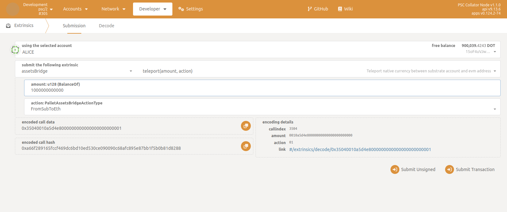

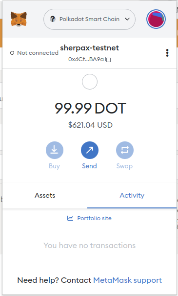

The transferable DOT is `99.99`, because `EXISTENTIAL_DEPOSIT = 0.01 DOT` on PSC.

For more details, By [this tool](../scripts/js/src/evm_to_dot.js), 
we can get the evm address's proxy substrate account.

```bash
node src/evm_to_dot.js 0x6CfE5574639Ba46d74b6b67D2651d1470E10BA9a
evm address:  0x6CfE5574639Ba46d74b6b67D2651d1470E10BA9a
dot account:  15gBPp5zAgaxtgzMi843onWu1gUuXbKMAy5Xu3XTNKcUqreH
```

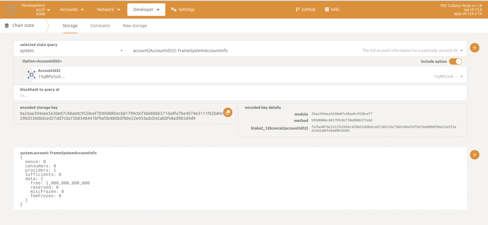

The balance is indeed `100` DOT.

### 3.4 Transfer DOTs to other evm account by metamask

Transfer `10` DOT from `0x6CfE5574639Ba46d74b6b67D2651d1470E10BA9a` to `0xcaf084133cbdbe27490d3afb0da220a40c32e307`

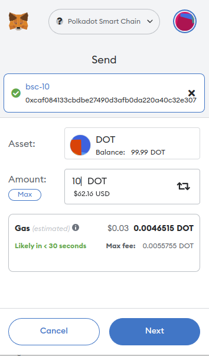

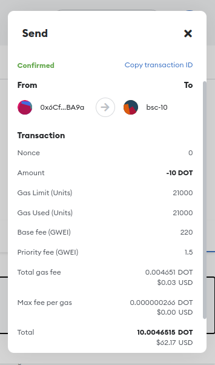

### 3.5 Withdraw some DOTs from evm account

The evm address `0x6CfE5574639Ba46d74b6b67D2651d1470E10BA9a` has been bound to the `Alice` substrate address `15oF4uVJwmo4TdGW7VfQxNLavjCXviqxT9S1MgbjMNHr6Sp5`.

`Alice` Call `assetsBridge->teleport` to withdraw `100000000000` (means 10 DOT, decimals=10) from `0x6CfE5574639Ba46d74b6b67D2651d1470E10BA9a`,

And it will deposit `100000000000` (means 10 DOT, decimals=10) into `Alice(15oF4uVJwmo4TdGW7VfQxNLavjCXviqxT9S1MgbjMNHr6Sp5)`.


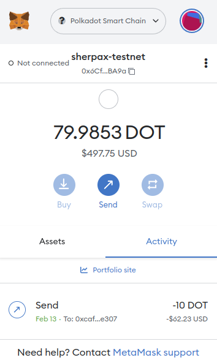

## 4. Advance: mapping wasm assets into evm tokens

### 4.1 Mint some wasm assets

Mint `1000000000000000000000` (means 1000 Reserved0, decimals = 18) to `Alice`

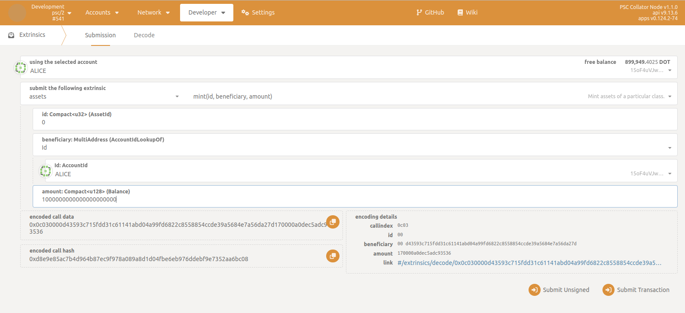

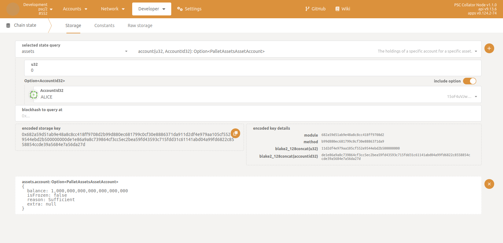


### 4.2 Deploy ERC20 contract

#### 4.2.1 Connect Remix

Run [remixd](https://www.npmjs.com/package/@remix-project/remixd) to access local [contracts](../contracts)

```bash
cd PSC
bash scripts/remix.sh
```

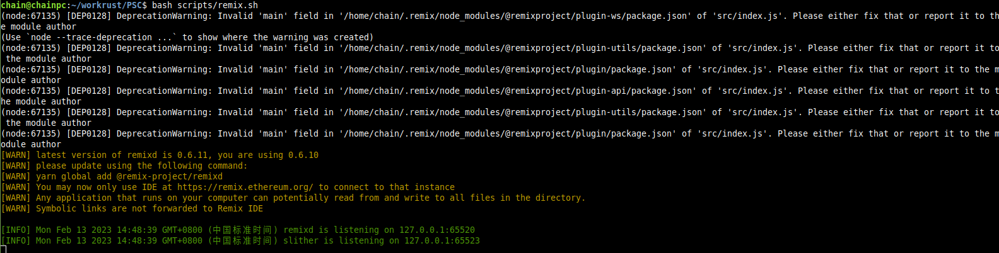

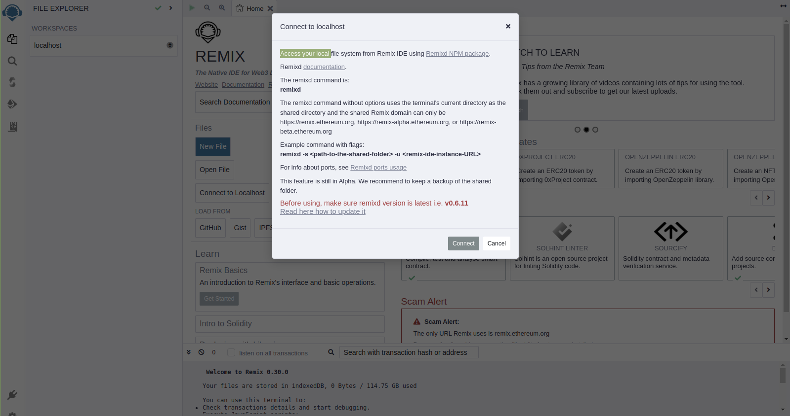

#### 4.2.2 Compile AssetsBridgeErc20_OnlyAdmin.sol

Choose `AssetsBridgeErc20_OnlyAdmin.sol` to compile

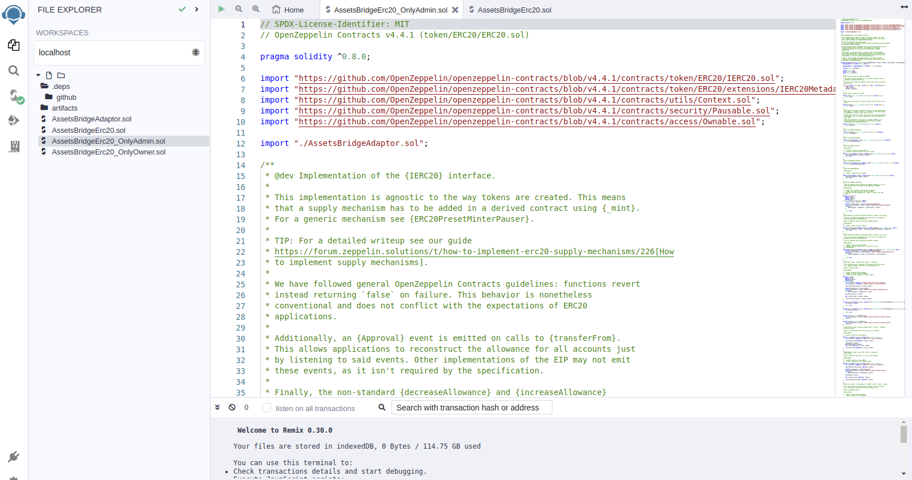

#### 4.2.3 Deploy contract

Deploy `AssetsBridgeErc20` contract
```txt
name = Reserved0
symbol = RSV0
decimals = 18
```

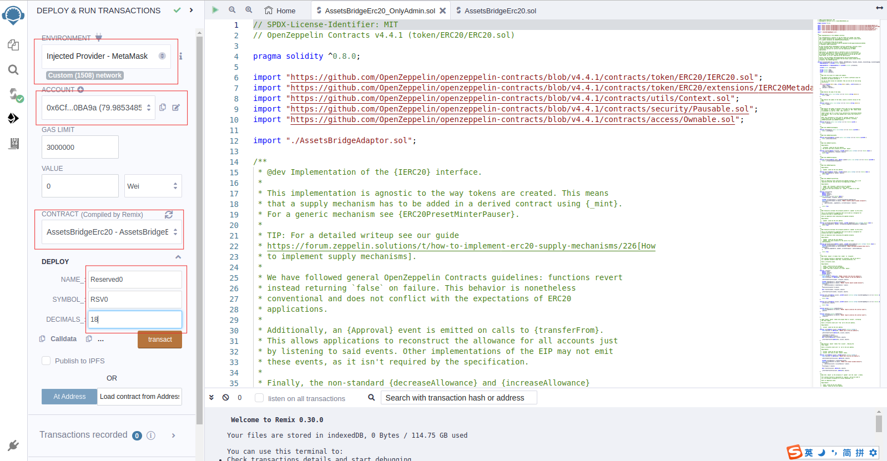

Get the contract address `0xf3607524cAB05762cB5F0cAb17e4cA3A0F0b4E87`

### 4.3 Bind wasm Reserved0 and erc20 Reserved0

For this guide, the admin of `assets-bridge` is Alice.

In the production environment, the admin of `assets-bridge` **must** audits 
whether the erc20 contract implements `IAssetsBridge` interface and 
whether it has the `AssetsBridgeAdmin` modifier.

Call `assetsBridge->register`


### 4.4 Deposit Reserved0 (wasm -> evm)
Deposit `1000000000000000000000` (means 1000 Reserved0, decimals = 18) Reserved0 from wasm to evm

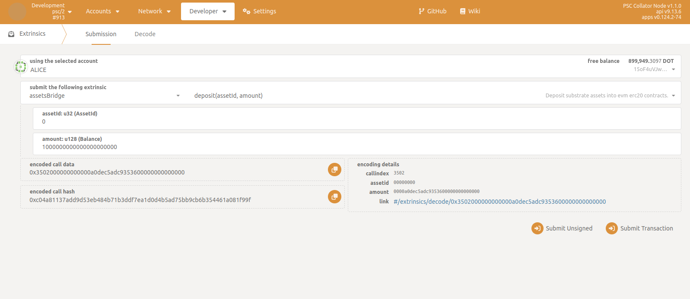

Before the balance is `0`, now is `1000000000000000000000` (means 1000 Reserved0, decimals = 18)

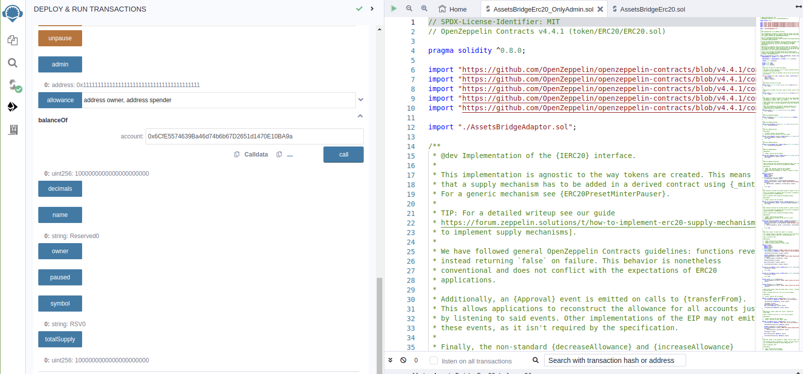

### 4.5 Withdraw Reserved0 (evm -> wasm)

Withdraw `1000000000000000000000` (means 1000 Reserved0, decimals = 18) from evm to wasm

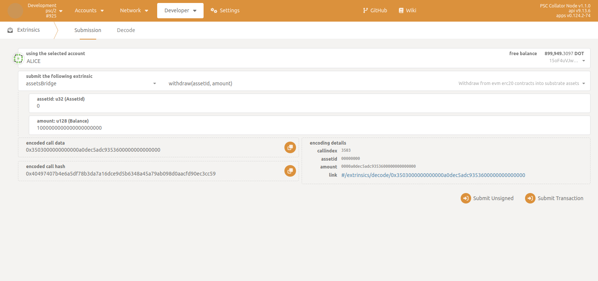

Before the balance is `1000000000000000000000` (means 1000 Reserved0, decimals = 18), now is `0`

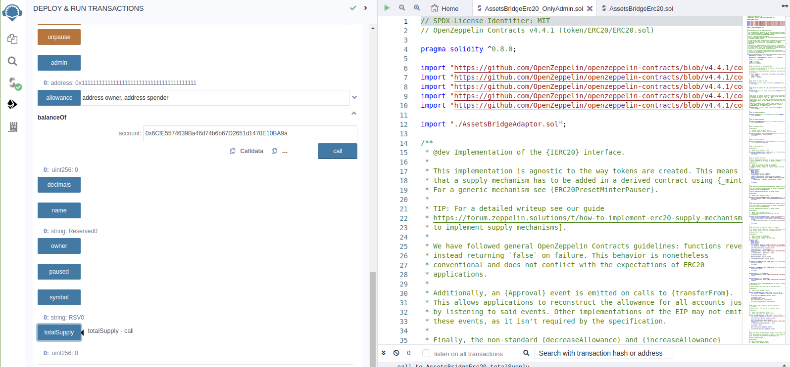